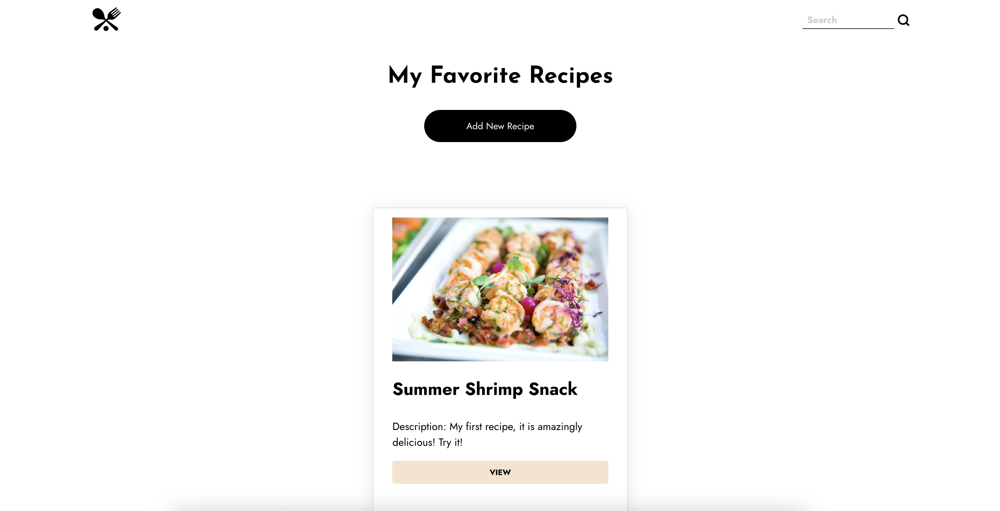

# 🍳 Recipe App

A full stack recipe management application built with Flask and React, allowing users to browse, search, and manage their favorite recipes.


## 📸 Preview



## 📋 Table of Contents

- [About](#about)
- [Features](#features)
- [Technologies Used](#technologies-used)
- [Getting Started](#getting-started)
- [Installation](#installation)
- [Running the Application](#running-the-application)
- [Project Structure](#project-structure)
- [Contributing](#contributing)

---

## 🎯 About

This Recipe App is a full stack web application that combines a Flask backend with a React frontend to create a seamless recipe management experience. Users can explore recipes, view detailed cooking instructions, and organize their culinary favorites all in one place.

## ✨ Features

- 📖 Browse and search through a collection of recipes
- 🔍 Filter recipes by ingredients, cuisine, or difficulty
- 📝 View detailed recipe information including ingredients and instructions
- 💾 SQLite database for efficient data storage
- 🎨 Responsive design for mobile and desktop viewing
- ⚡ Fast and intuitive user interface

## 🛠️ Technologies Used

### Frontend
- **React** - Component-based UI library
- **CSS3** - Styling and responsive design
- **JavaScript** - Interactive functionality

### Backend
- **Flask** - Python web framework
- **SQLite** - Lightweight database
- **Python** - Server-side logic

### Development Tools
- Create-React-App for React setup
- Flask virtual environment
- npm for package management

---

## 🚀 Getting Started

This project requires two servers running simultaneously:
1. **Flask server** (backend) - runs on port 5000
2. **React server** (frontend) - runs on port 3000

You'll need to have **Python 3** and **Node.js** installed on your machine.

## 📦 Installation

### Prerequisites

Make sure you have the following installed:
- Python 3.x
- Node.js and npm
- pip (Python package manager)

### Step 1: Clone the Repository

```bash
git clone https://github.com/CatYoung018/recipe-app.git
cd recipe-app
```

### Step 2: Set Up Flask Backend

Navigate to the `/api` directory and create a virtual environment:

```bash
cd api
python -m venv venv
```

Activate the virtual environment:

**On macOS/Linux:**
```bash
source venv/bin/activate
```

**On Windows:**
```bash
venv\Scripts\activate
```

Install Python dependencies:

```bash
pip install -r requirements.txt
```

### Step 3: Set Up React Frontend

Open a new terminal window, navigate back to the root directory, and install React dependencies:

```bash
npm install
```

---

## ▶️ Running the Application

You'll need **two terminal windows** open simultaneously.

### Terminal 1: Start the Flask Server

**On macOS/Linux:**
```bash
# Make sure you're in the root directory
npm run start-api
```

**On Windows:**
```bash
cd api
flask run --no-debugger
```

You should see output indicating the Flask server is running on `http://localhost:5000`

### Terminal 2: Start the React Server

In your second terminal window (from the root directory):

```bash
npm run start
```

The React development server will start on `http://localhost:3000`, and your browser should automatically open the application.

---

## 🛑 Stopping the Application

### Stop Flask Server
- Use `Ctrl + C` to stop the server
- Run `deactivate` to exit the virtual environment

### Stop React Server
- Use `Ctrl + C` to stop the server

---

## 📁 Project Structure

```
recipe-app/
├── api/                    # Flask backend
│   ├── venv/              # Virtual environment (not tracked)
│   ├── requirements.txt   # Python dependencies
│   └── [Flask files]
├── public/                # Static files
├── src/                   # React components and files
│   ├── components/        # React components
│   ├── App.js            # Main React component
│   └── index.js          # React entry point
├── package.json          # Node dependencies
└── README.md            # Project documentation
```

---

## 🎨 Features in Development

- [ ] User authentication and profiles
- [ ] Recipe rating and reviews
- [ ] Shopping list generator
- [ ] Meal planning calendar
- [ ] Recipe sharing functionality

---

## 👥 Contributing

Contributions are welcome! If you'd like to improve this project:

1. Fork the repository
2. Create a feature branch (`git checkout -b feature/AmazingFeature`)
3. Commit your changes (`git commit -m 'Add some AmazingFeature'`)
4. Push to the branch (`git push origin feature/AmazingFeature`)
5. Open a Pull Request

---

## 📝 License

This project is open source and available for educational purposes.

---

## 📧 Contact

**Cat Young**  
- GitHub: [@CatYoung018](https://github.com/CatYoung018)
- LinkedIn: [Catrillia Young](https://www.linkedin.com/in/catrillia-young18/)
- Portfolio: [catyoung018.github.io/Cat-Young-Dev](https://catyoung018.github.io/Cat-Young-Dev/)

---

<div align="center">

**Happy Cooking! 🍳👨‍🍳👩‍🍳**

⭐ Star this repo if you find it helpful!

</div>